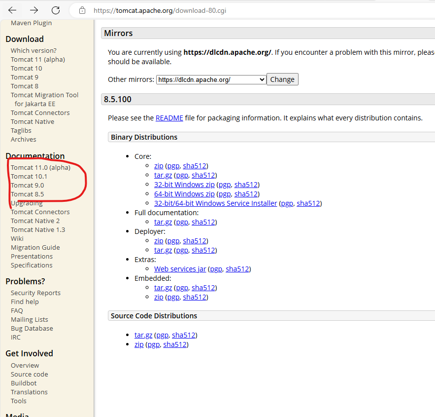

### 环境 Tomcat
下载地址
> https://tomcat.apache.org/download-80.cgi


```
用idea工具开发可以不用
set CATALINA=C:\apache-tomcat-5.5.29
set CLASSPATH=%CATALINA%\common\lib\servlet-api.jar;%CLASSPATH%
```

如果使用的是压缩版 可以用以下方法创建服务（用idea工具开发可以不创建）
> httpd -k start/stop/restart -n 服务名称

```
apache-tomcat-8.5.100\bin  
                       startup.bat 启动程序
apache-tomcat-8.5.100\conf 配制文件
                       server.xml  8.5 （参考 端口配制）
                       httpd.conf  old 
                       logging.properties  日志编码
apache-tomcat-8.5.100\webapps（htdocs） 项目放置位置
apache-tomcat-8.5.100\lib  包
                      servlet-api.jar  
                        import javax.servlet.http.HttpServlet;
``` 

### 端口配制
```xml
    <Connector port="8080" protocol="HTTP/1.1"
               connectionTimeout="20000"
               redirectPort="8443"
               maxParameterCount="1000"
               />
```

### 日志编码

如果idea日志有乱码修改以下

```properties
1catalina.org.apache.juli.AsyncFileHandler.encoding = GBK
java.util.logging.ConsoleHandler.encoding = GBK
```


### maven
- 下载地址
> https://maven.apache.org/download.cgi

- pom.xml参考
> https://mvnrepository.com/

```xml
<!-- https://mvnrepository.com/artifact/javax.servlet/javax.servlet-api -->
<dependency>
    <groupId>javax.servlet</groupId>
    <artifactId>javax.servlet-api</artifactId>
    <version>4.0.1</version>
    <scope>provided</scope>
</dependency>

```


> https://tomcat.apache.org/download-80.cgi




