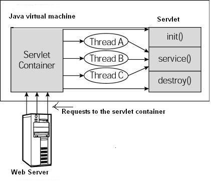

### HTTP请求类型
|GET|获取|
|POST|新增|
|PUT|修改|
|DELETE|删除|

详细
> https://www.runoob.com/http/http-methods.html


### Servlet 生命周期方案

第一个到达服务器的 HTTP 请求被委派到 Servlet 容器。<br>
Servlet 容器在调用 service() 方法之前加载 Servlet。<br>
然后 Servlet 容器处理由多个线程产生的多个请求，每个线程执行一个单一的 Servlet 实例的 service() 方法。




- init ()
  方法被设计成只调用一次。它在第一次创建 Servlet 时被调用

- destroy() 
  只会被调用一次，在 Servlet 生命周期结束时被调用。destroy() 方法可以让您的 Servlet 关闭数据库连接、停止后台线程、把 Cookie 列表或点击计数器写入到磁盘，并执行其他类似的清理活动。

### Servlet和url绑定
- 注解和xml二选一
```java
@WebServlet(name = "HelloServlet", value = "/Hello")
```

@WebServlet 注解的属性
@WebServlet 用于将一个类声明为 Servlet，该注解会在部署时被容器处理，容器根据其具体的属性配置将相应的类部署为 Servlet。该注解具有下表给出的一些常用属性。

|属性名|类型|标签|描述|是否必需|
|---|---|---|---|---|
|name|String|<servlet-name>|指定 Servlet 的 name 属性。
如果没有显式指定，则取值为该 Servlet 的完全限定名，即包名+类名。|否|
|value|String[]|<url-pattern>|该属性等价于 urlPatterns 属性，两者不能同时指定。如果同时指定，通常是忽略 value 的取值。|是|
|urlPatterns|String[]|<url-pattern>|指定一组 Servlet 的 URL 匹配模式。|是|
|loadOnStartup|int|<load-on-startup>|指定 Servlet 的加载顺序。|否
|initParams|WebInitParam[]|<init-param>	|指定一组 Servlet 初始化参数。|否|
|asyncSupported|boolean|<async-supported>	|声明 Servlet 是否支持异步操作模式。|否|
|description|String|<description>|指定该 Servlet 的描述信息。|否|
|displayName|String|<display-name>|指定该 Servlet 的显示名。|否|


```xml
<welcome-file-list>
  <welcome-file>index.jsp</welcome-file> <!-- 默认打开页面 -->
</welcome-file-list>

  <servlet>
      <servlet-name>HelloServlet</servlet-name>
      <servlet-class>controller.HelloServlet</servlet-class> <!-- 包+类名 -->
  </servlet>
    <servlet-mapping>
      <servlet-name>HelloServlet</servlet-name>
      <url-pattern>/Hello</url-pattern><!-- url -->
  </servlet-mapping>
```


### 页面提交数据方法
 ```html

 1
 <a href="url+? +参数"></a>
 <a href="/login?name=aa&pasword=123"></a>

 2
 <form action="/Login" method="post">
     <input type="text" id="username" name="username"> <br>
     <input type="password" id="password" name="username"> <br>
    <input type="submit" value="submit">
</form>
```

```js
3
$.ajax({
    url:"/Login",
    type:"get",
    data:{"username":"a","password":"123"}  ,
    dataType:"json",
    success:function(result){
            $("#JqDiv").html(result.username);
    },
    error:function(result){
        alert(result);
    }
});
 ```
### java 获取页面数据方法
```java
request.getRequestDispatcher("/index.jsp").forward(request, response);

response.sendRedirect("http://www.baidu.com");//重定向 让页面自己打开为个地址

```


### java 获取页面数据方法

```java
request.getParameter("bb");  //name 值
request.getParameterValues("aa");
// --> demo1 -->LoginServlet
```


### java 传值给 页面数据方法
```java
//1
request.getSession().setAttribute("v1", "123");
//2
request.setAttribute("v2", "456");   
//3
Cookie cok = new Cookie("token", "789");
// 为两个 Cookie 设置过期日期为 24 小时后
cok.setMaxAge(60*60*24);
// 在响应头中添加两个 Cookie
response.addCookie( cok );
``` 
> 以上三种区别  <br>
session、cookie、token的区别.md <br>
 HelloServlet HelloServlet2

用户登录就好像 是用户拿钥匙开门一样
token 钥匙
filter 门 参考filter

Session  用户信息  SessionId =token
Cookie token
request.getSession().setAttribute(token, user);


LoginServlet2 参考


### filter 
- 注解和xml二选一

```xml
    <filter>
        <filter-name>MyFilter</filter-name>
        <filter-class>com.example.demo1.MyFilter</filter-class><!-- 绑定java-->
        <init-param>
            <param-name>Site</param-name>
            <param-value>菜鸟教程</param-value> <!-- 可以写多个-->
        </init-param>
    </filter>
    <filter-mapping>
        <filter-name>MyFilter</filter-name>
        <url-pattern>/admin/*</url-pattern><!-- 绑定url 拦截/admin开头的请求-->
    </filter-mapping>
```

```java
@WebFilter(filterName="myfilter2",urlPatterns="/*" ,initParams= {@WebInitParam(name="abc",value="abc") , @WebInitParam(name="Site",value="addbc")}) 
```

