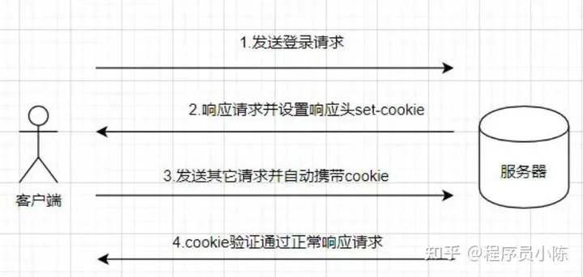
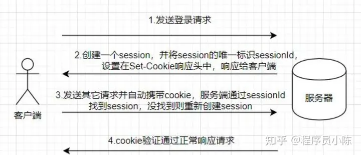

### Cookie
Cookie 是一种在客户端存储数据的技术，它是由服务器发送给客户端的小型文本文件，存储在客户端的浏览器中,大小限制大致在 4KB 左右。

cookie的主要属性
|属性名|描述|
|---|---|
|name|cookie 的名称|
|value|cookie 的值|
|comment|cookie 的描述信息|
|expires|cookie 的过期时间，具体某一时间|
|maxAge|cookie 的过期时间|

cookie 主要特点
- cookie 存储在客户端
- cookie 不可跨域，但是在如果设置了 domain，那么它们是可以在一级域名和二级域名之间共享的。

### session
每一个客户端与服务端连接，服务端都会为该客户端创建一个 session，并将 session 的唯一标识 sessionId 通过设置 Set-Cookie 头的方式响应给客户端，客户端将 sessionId 存到 cookie 中。

session 比 cookie 更加安全，因为它是存在服务端的，cookie 是存在客户端的。
cookie 只支持存储字符串数据，session 可以存储任意数据。
cookie 的有效期可以设置较长时间，session 有效期都比较短。
session 存储空间很大，cookie 有限制。

### Token
Token是一个由一串字符组成的令牌，用于在计算机系统中进行身份验证和授权。